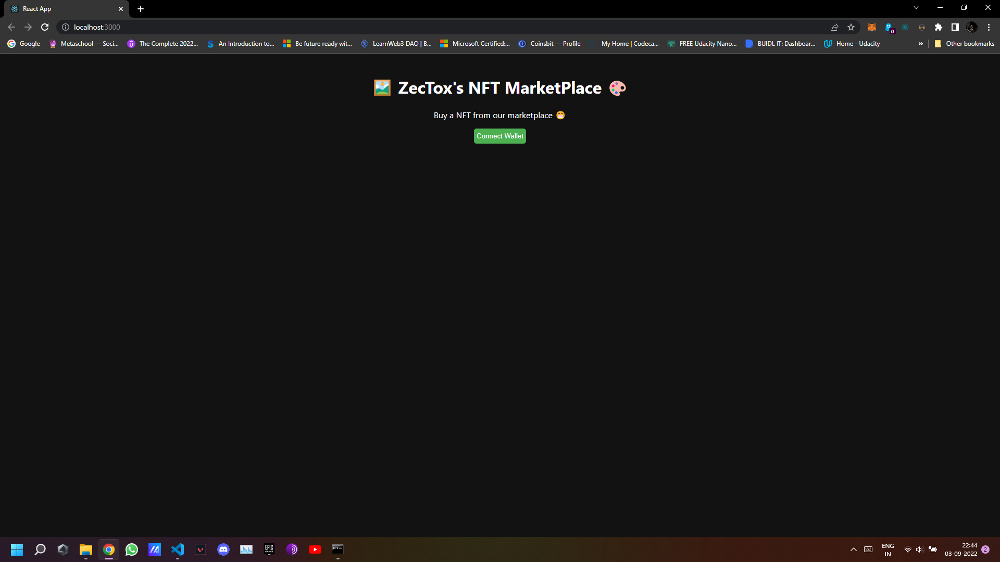
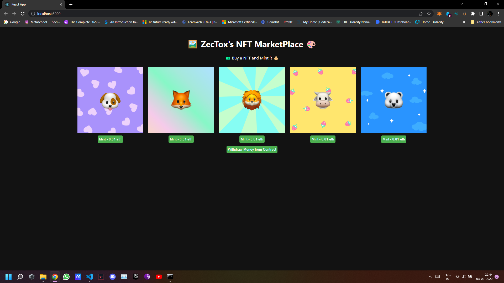

# 👀 Preview 👀  
</img>
</img>
# 🖼️ NFT_Marketplace_Project 🎨

<h2> Intro </h2>
This would be a NFT Marketplace project made by Me by doing the course from MetaSchool.so about "Launch your own epic Marketplace".

<h2>🌱 Skills I will be learning while making this Project 🧑🏾‍💻 </h2>

<h4>1. Writing Smart Contracts in Solidity</h4>
<h4>2. Using Open Zepellin</h4>
<h4>3. Working with ERC721 Smart Contracts</h4>
<h4>4. Hosting metadata on IPFS using Pinata</h4>
<h4>5. Compiling and Deploying Smart Contracts using hardhat</h4>
<h4>6. Connecting to the Alchemy Node Service</h4>
<h4>7. Setting a minting price on NFTs</h4>
<h4>8. Setting a minting limit per user</h4>
<h4>9. Creating a basic react marketplace for your NFTs</h4>
<h4>10. Connecting metamask to react frontend</h4>
<h4>11. Calling Solidity Smart Contract from react</h4>
<h4>12. Withdrawing Money from a Smart Contract</h4>

😁 Steps if you want to clone the Repository 😁
<h3> To install the dependencies clone the project and then install it </h3>
<h4>1. npm init </h4>
<h4>2. create a .env file and store the API key from ALCHEMY and Privste key from the metamask </h4>
<h4> API_URL = PASTE-YOUR-ALCHEMY-HTTPS-URL  
PRIVATE_KEY = PASTE-YOUR-PRIVATE-KEY-FROM-METAMASK-WALLET  
API_KEY = PASTE-IT-FROM-ALCHEMY-ACCOUNT  </h4>

 Environment - Staging  
Chain - Ethereum   
Network - Rinkeby </h6>  

# Now Enjoy with the NFT_MARKETPLACE PROJECT 😁
